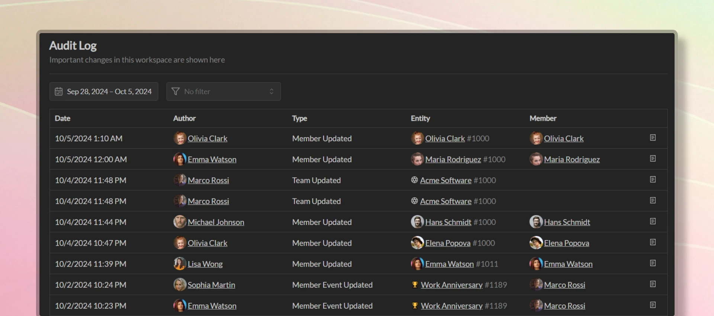

import { Aside } from '@astrojs/starlight/components';

Temporal automatically tracks all changes made to your workspace. The audit log provides a detailed history of all changes made to your workspace, including who made the change, what was changed, and when the change was made. All audit logs are retained for 90 days.

Workspace administrators can access all audit logs by navigating to Workspace Settings -> Audit Log, where they can filter logs by date, user, and action type.

Individual team and member screens also have their own audit logs, which can be accessed by navigating to the team or member settings and clicking on the "Audit Log" tab. These can be accessed by anyone in the workspace.