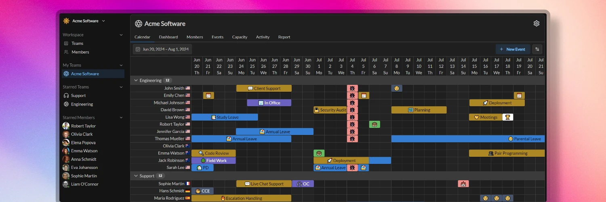

Understanding Temporal's core concepts will help you set up your workspace efficiently and navigate the platform with ease. Let's explore the key elements that make up the Temporal ecosystem.

## Workspace

A workspace in Temporal serves as the main working environment, acting as a digital hub for your organization. Here, you can create, manage, and organize your teams and events with ease. Think of it as a container that holds all the data related to an individual company or organization. Each workspace is uniquely identifiable by its URL, following the format temporal.app/example. As a user, you have the flexibility to belong to multiple workspaces, easily switching between them using the workspace menu located in the top left corner of the application. Temporal allows for the creation of up to 100 workspaces per user account, providing ample room for complex organizational structures or multiple projects.

## Members

Members are the foundational elements of a workspace, representing the entities on whose behalf events are created. While members are typically users, this isn't always the case. Every user has an associated member in a workspace, but not every member is necessarily a user. When a member profile has an associated email address, it opens up the possibility for the person with that email to log in to the workspace and assume that member's identity. This flexibility allows for various scenarios, such as managing schedules for resources or roles that may not have a direct user login.

## Teams

Within a workspace, you can create one or multiple teams, typically representing groups of people collaborating towards a shared goal. Each team is structured with a clear hierarchy: there must be an owner, and there can be one or multiple administrators. These leadership roles come with the responsibility of managing team settings, adding or removing members, and designating administrators. 

Team members have the ability to create, update, or delete member events for their fellow team members, fostering a collaborative environment. 

Teams can have custom settings that can overwrite or extend workspace settings.

## Event Types

In Temporal, every calendar event is assigned a type, serving as a tool for categorization and default setting definition. For instance, "Annual Leave" could be an event type used to categorize planned vacations. 

Each workspace can have its own unique set of event types, reflecting the specific needs of the organization. This flexibility extends to the team level as well, where individual teams can create their own event types to cater to their particular requirements.

## Event Categories

Event categories in Temporal serve as a higher level of organization, grouping related event types together. This grouping allows for shared settings among similar event types. For example, a category like "Planned Time Off" might encompass event types such as "Annual Leave," "Parental Leave," and "Travel". 

Event categories can be scoped as either "member" or "group" events, determining whether the event types within them are intended for member events or group events. Similar to event types, individual teams have the freedom to create their own event categories, allowing for a tailored organizational structure that meets their specific needs.

## Calendar Events

### Member Event

Member events form the backbone of individual scheduling in Temporal. Members have the ability to create these events for themselves or for other members, utilizing the preconfigured event types and categories. This system allows for flexible, personalized scheduling within the established organizational framework.

### Group Event

Group events in Temporal are designed to apply to multiple members simultaneously, based on preconfigured criteria. A common example of a group event would be a regional holiday that affects all members in a specific location. Due to their broad impact, the creation of group events is restricted to workspace administrators, ensuring centralized control over organization-wide scheduling.

## Capacity

Capacity in Temporal is a vital metric used to represent a member's availability for their regular work. It's quantified on a scale from 0% to 100%, where 0% indicates the member is not available at all, and 100% signifies full availability. This concept becomes particularly useful when planning staffing for upcoming periods, especially in roles that require a certain number of people to be available. 

Various elements can influence a member's capacity: the members themselves, event types, event categories, member events, and group events can all have custom modifiers that affect the final capacity calculation. This multi-faceted approach allows for nuanced and accurate representation of availability across your organization.