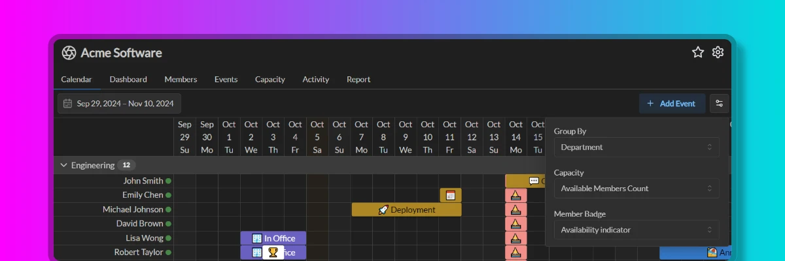

import { Aside } from '@astrojs/starlight/components';

Temporal provides a variety of calendar views to help you visualize your team's schedule. You can configure these views to show the information that is most relevant to you. Calendar configurations are kept per team, so each team can have its own calendar view configuration.

## Calendar View Settings

### Group By

The **Group By** setting allows you to group members in the view by a certain criteria. You can group events by:

- Common member attributes, such as their country, time zone, work hours and others
- Custom member tags

<Aside type='tip' title='Pro Tip'>
	Add custom tags to your members to better organize them in calendar views. For example, you can tag members with their role, department, or any other attribute that is important to your organization.
</Aside>

### Capacity

The **Capacity** setting allows you to show the total capacity of all members in the view. You can show the capacity as:

- **Available Members Count**: Shows the total sum of individual capacities of members who have non-zero capacity.
- **Unavailable Members Count**: Shows the total sum of individual capacities of members who have zero capacity.
- **Forecast Deviation**: Shows the difference between the total capacity and a constant value. This is useful for comparing the total capacity against a target value.
- **None**: Disables the capacity display.

### Member Badge

The **Member Badge** setting allows you to show a badge on each member's cell in the view. You can show the badge as:

- **Availability Indicator**: Shows a colored indicator based on the member's availability, where green indicates availability, gray indicates unavailability, and orange indicates partial availability.
- **Country Flag**: Shows the country flag of the member if the member has a country set in their profile.
- **None**: Disables the member badge display.