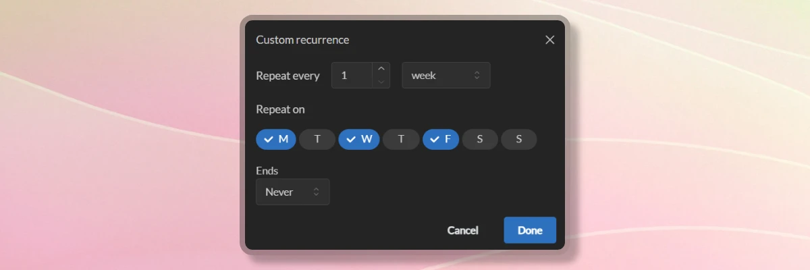

import { Aside } from '@astrojs/starlight/components';

Member events are calendar entries that can be created by any member in Temporal. Member events serve two main purposes:

- Changing the availability of a member throughout the event time range, making them either available, unavailable or partially available.
- Communicating the event details to other members in the workspace for the purpose of collaboration and coordination.

## Different ways to create

You can initiate creation of a member event from a team screen in several ways:

- Click "Add Event" button.
- Use drag-and-drop to select a time range on the calendar grid.
- Click any empty cell on the calendar grid.

The event creation dialog will appear, where you can input the event details. If you click "More Options" button, the dialog will be shown full screen with additional event creation options available.

<Aside type='tip'>
	If you need to create an overwrite for a holiday or create an event that covers the date range of other events for that member, use "Add Event" button.
</Aside>

## Creating a member event

1. Go to the team screen where you want to create the event.
2. Click "Add Event" button or click the day or time range in the calendar you want to use for the event.
3. If you started the event creation from "Add Event" button, select the team member you want to create the event for.
4. Select the **Event type** for the event. The type should belong to an event category with a "Member" scope to appear in the select control.
5. If you started the event creation from "Add Event" button, indicate the date range you want to use for the event.
6. If you are planning ahead by pre-booking certain slots, you can uncheck **Confirmed** option to make the event appear as a tentative event. Tentative events will appear distinctively in the calendar, and can be confirmed later once you finalize the details.
7. Optionally, you can add a description to the event to provide more context to the event.

### Additional event details

When you click "More Options" button, you will be able to set additional event details, such as:

- **Time Zone**: By default, a member's time zone is used for the event. If the member does not have a time zone set, your browser's time zone will be used instead.
- **Capacity Modifier**: This value will be used to adjust the member's capacity during the event time range. You can set the member to be unavailable (0%), available (100%) or partially available (anything in between). Event capacity is determined by event type's default capacity modifier, parent event type category's default capacity modifier, and member's default capacity modifier.
- **Recurrence**: You can set the event to repeat on a certain schedule. You can choose between daily, weekly, monthly, and yearly recurrence patterns.

Additional detail values are automatically set based on the context, but can be overridden if needed.