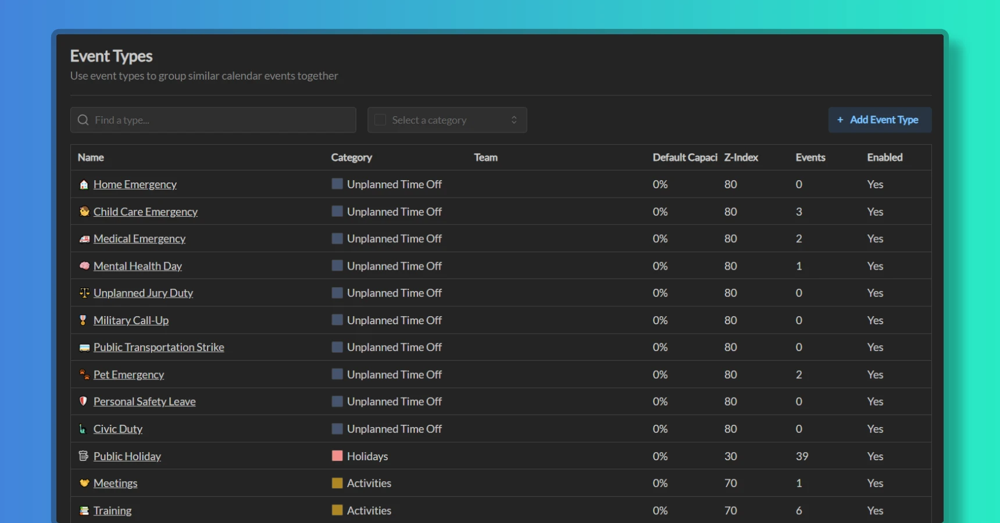

import { Aside } from '@astrojs/starlight/components';

Event types are a way to group related events together. Event types can be used to categorize events that share the same settings, such as colors, capacity modifier, and others.

<Aside type="tip" title='Good to know'>
	When creating a workspace with either Demo or Basic datasets, the workspace will be preconfigured with a set of event types, which is a good place to start. You can customize these event types or create new ones to better suit your needs.
</Aside>

## Creating event types

1. Go to Workspace Settings -> Event Types
2. Click the "Add Event Type" button
3. Select parent **Event Category**. The category must already exist in the workspace.
3. Enter **Name**. Name must be unique within the workspace.
4. Enter **Description** (optional). Descriptions will be shown to the user when creating events, helping them understand the purpose of the event type.
5. Optionally, you can override settings that come from the event category, such as **Color**, **Capacity Modifier** and **Z-Index**.

<Aside>
	Most of the time, you'd want to set the capacity modifier to either 0% (Unavailable) or 100% (Available) for the event types, depending on the purpose of this type. This value can be overwritten by individual events.
</Aside>

## Disabling event types

When an event type is marked as disabled, it will not be shown to the user when creating events. The event type will still be visible in the workspace settings and dialog screens, but the user will not be able to create events with this type.

## Team event types

Individual teams can create their own event types. These types will only be shown when creating events for the team members. 

## Which event types to add

Not every activity needs to be tracked. To avoid polluting the calendar views with too many events, complicating consumption of information in Temporal, consider the following:

- What kind of events you want to track and/or report on?
- What kind of events you want your team members to use to communicate to each other?
- What kind of events represent an important deviation from the normal work schedule?

Only add event types that are important for reporting purposes or for the purpose of communicating team activities between team members. If some activity is not something you want to aggregate in reports, you might not need to add it.

<Aside type='tip'>
	Preconfigured event types in the Demo and Basic datasets are a good starting point for any enterprise. Review them and adjust as needed.
	
	Delegate creation of event types representing activities to individual teams.
</Aside>