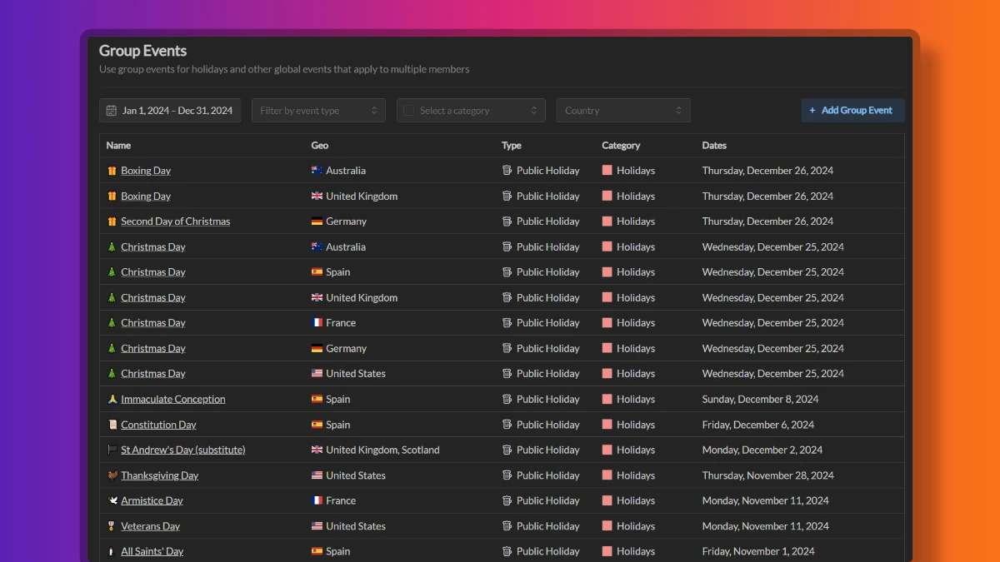

import { Aside } from '@astrojs/starlight/components';

Group events in Termporal are calendar events that apply to multiple members via a certain criteria, usually a geo location. Group events are typicall used to represent regional holidays or events specific to a certain location.

## Creating group events

Workspace administrators can create new group events inside the workspace using these steps:

1. Go to Workspace Settings -> Group Events
2. Click the "Add Group Event" button
3. Select **Event Type**. The event type must belong to an event category with "Group" scope.
4. Enter **Name**, and you can optionally select an icon for the event.
5. Input a date for the event.
6. Complete the geo information for the event. This includes the country, state, county, and city where the event is taking place.
7. Designate the **Capacity Modifier** for the event. This value will be used as a default capacity modifier for the event when creating events.

<Aside>
	Certain regional holidays are officially announced as half-days, to better represent the capacity of the event, you can set the capacity modifier to 50%. Adjust the capacity modifier as needed to represent whether the affected members should be unavailable (0%), available (100%), or partially available (anything in between).
</Aside>