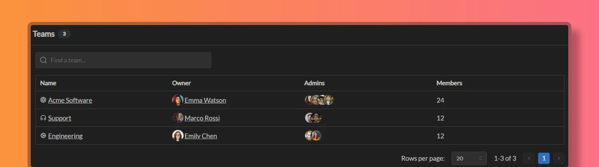

Teams are a way to group members in Temporal. Teams can be used to manage schedules, create events, and collaborate on projects. 

## Creating teams

Workspace administrators can create new teams inside the workspace using these steps:

1. Go to Workspace Settings
2. Click the "Add team" button
3. Enter **Team Name**. 
4. Decide who is going to be **Owner** for this team.
5. Optionally, you can designate team administrators to help manage this team.
