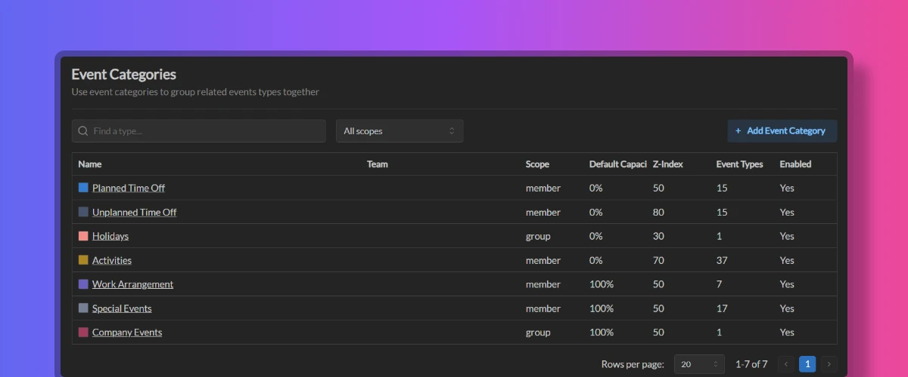

import { Aside } from '@astrojs/starlight/components';

Event categories are a way to group related event types together. Event types assigned to the same category will share the same settings, such as colors, capacity modifier and others.

<Aside type="tip" title='Good to know'>
	When creating a workspace with either Demo or Basic datasets, the workspace will be preconfigured with a set of event categories, which is a good place to start. You can customize these categories or create new ones to better suit your needs.
</Aside>

## Creating event categories

Workspace administrators can create new event categories inside the workspace using these steps:

1. Go to Workspace Settings -> Event Categories
2. Click the "Add Event Category" button
3. Enter **Name**. Name must be unique within the workspace.
4. Enter **Description** (optional).
5. Select a **Color** for the category. This color will be used to represent the category in the calendar. You can specify different values for light and dark themes.
6. Designate the default **Capacity Modifier** to the category. This value will be used as a default capacity modifier for all event types in this category when creating events.
7. Designate **Z-Index** for the category. This value will be used to determine the order in which calendar events are displayed in the calendar should they overlap each other. Events with higher z-index values will be displayed on top of categories with lower z-index values.
8. Select the scope for this category. You can choose between **Member** and **Group**. Event categories in Member scopes can be used to categorize events types that can be used to create member events, and event categories in Group scopes can be used to categorize event types that can be used to create group events.

<Aside>
	Most of the time, you'd want to set the capacity modifier to either 0% (Unavailable) or 100% (Available) for the event categories, depending on the purpose of this category. This value can be overwritten by event types in this category.
</Aside>

Make sure you have created at least 1 category in Member scope and 1 category in Group scope to be able to create event types for both member and group events respectively.

## Disabling event categories

When event category is marked as disabled, its event types will not be shown to the user when creating events. The event category will still be visible in the workspace settings and dialog screens, but the user will not be able to create events with event types from this category.

## Team event categories

Individual team can create their own event categories. These categories will only be shown when creating events for the team members.