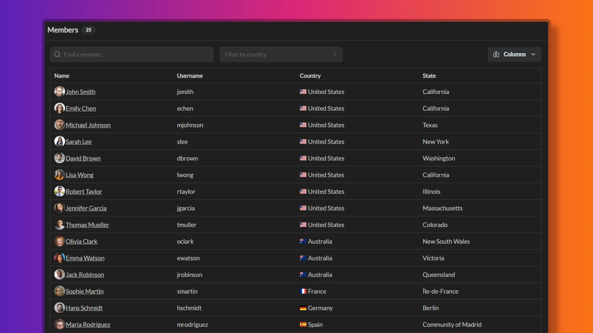

import { Aside } from '@astrojs/starlight/components';

Members represent the people in your organization who will be using Temporal. You can manually create, suspend and re-activate members from the workspace members page.

It is important to understand the difference between a member and a user: a member is a person who has been added to a workspace, while a user is a person who has an account on Temporal. Members with an email address that matches an existing user account will be automatically linked to that account, and user will be able to assume the the identity of the member in that workspace. Inside a workspace, any user has an associated member profile, but not every member has an associated user account.

## Creating members

Workspace administrators can create new members inside the workspace using these steps:

1. Go to Workspace Settings -> Members
2. Click the "Add Member" button
3. Enter **Display Name** for a member. This is the name that will be displayed in the workspace and is usually set to a full name of person you want to manage.
4. Enter **Username** for a member. This is the unique identifier for the member inside the workspace and is usually set to an email address (or to its unique part). No two members of the workspace can have the same username.
5. If you would like to link this member account to a user account, enter the email address of the user account in the **Email Address** field. If the email address matches an existing user account, the member will be linked to that account. If the email address does not match an existing user account, the member will be created without a user account.
6. Optionally, you can enter a title for the member in the **Title** field. This is usually set to the job title of the person you want to manage.
7. Optionally, provide geo information for the member.
8. Provide work hours for the member.
9. Change the default capacity modifier from 100% to a different value if needed. This value will be used as a default capacity modifier for the member when creating events.
10. Input any member-specific tags you want to add, for example, a department, division or a manager name.

There is no limit to the number of members you can add to a workspace.

<Aside>
	On free plans, all users are workspace administrators and thus have the ability to create new member accounts.
</Aside>

### Geo information

Geo information for a member consists of the following fields:
- **Country** - the country where the member is located
- **State** (aka region, land or canton) - the state or region where the member is located
- **County** (aka district)- the subdivision of a state or region
- **City** - the city where the member is located

Geographical information is used to determine which group events apply to a member as well as for visual purposes.

### Work hours

Work hours for a member consist of the following fields:
- **Start Time** - the time when the member starts working, e.g. 8:00 AM
- **End Time** - the time when the member finishes working, e.g. 5:00 PM

Start and end times define the working hours for a member and is used in capacity calculations as well as to determine when a member is off shift.

### Member tags

You can add tags to a member to categorize them. Tags can be used to filter members in the members list and to group members in reports. Tags can be anything you want, for example, a department, division, or a manager name.

Tags are a key-value pairs assigned to a member.

## Member Status

Members can have one of the following statuses:
- **Active** - the member is active and can login to the workspace
- **Suspended** - the member is suspended and cannot login to the workspace

Workspace administrators can suspend and re-activate members from the workspace members page. Suspended members will not be able to log in to the workspace and will not receive notifications about events. Suspended members team assignments are preserved and it is up to the team administrators to remove suspended members from the team. Team views, however, will only show active members.

### Suspending members

When suspending a member, they will lose the ability to log into the workspace. However, it is important to know suspended members will still be able to have read access according to their role for up to 1 hour after suspension. They will however not be able to do any changes immediately after suspension.

### Activating members

When activating a member, they will regain the ability to log into the workspace and receive notifications about events. This change takes effect immediately.

## User Roles

There are several preconfigured user roles in Temporal.

### Workspace Administrator

On free plans, all members of the workspace have Workspace Admin privileges.

On paid plans, the creator of the workspace and/or the member who upgrades the workspace to a paid subscription are granted Workspace Admin roles.

Workspace Admins on paid plans are the only users who can:

- Grant or remove Workspace Admin roles
- Create new members
- Suspend or activate members
- Create, update or delete group events
- Create, update or delete teams
- Manage any team settings and members
- Create, update or delete any member events
- Manage workspace settings

<Aside>
	Some workspace settings can only be managed by a workspace owner and not anyone else, f.e. transferring the ownership of a workspace to a different member.
</Aside>

### Team Administrator

Each team in Temporal has an owner and may have one or more team administrators who share the responsibilities of managing the team. They can do the following:

- Add or remove members from the team
- Create, update or delete calendar events for team members
- Create, update or delete custom event categories and event types for the team
- Manage team settings

### Team Member

Members in a team can create, update and delete member events on behalf of other team members.
