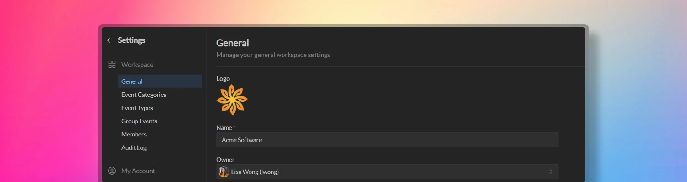

A workspace is the home for all events and interactions for an organization. We recommend organizations staying within a single workspace as this is the conceptual model we use when designing the product.

When a workspace is created, Temporal automatically creates a default team with the same name.

## Workspace settings

Navigate to *Workspace Settings -> General* by clicking the workspace menu at the top left of the screen.

Workspace administrators will be able to:

- Update a workspace name
- Change the workspace URL (only available for paid plans)
- Transfer the ownership of the workspace to another member
- Assign workspace administrators

### Delete workspace

Deleting a workspace includes deleting all member and events data. Only the workspace owner can delete a workspace.

Deleting a workspace will revoke all access to the workspace for all authorized members, after which the workspace will be placed in a 30-day grace period before being permanently deleted. To restore the deleted workspace within the 30-day grace period, the workspace owner will need to contact Temporal support.

## Multiple workspaces

You can create multiple workspaces in Temporal under a single user account (e.g. tied to a specific email address) and switch between them at any time.

A single user account can have up to 100 workspaces assigned to it.